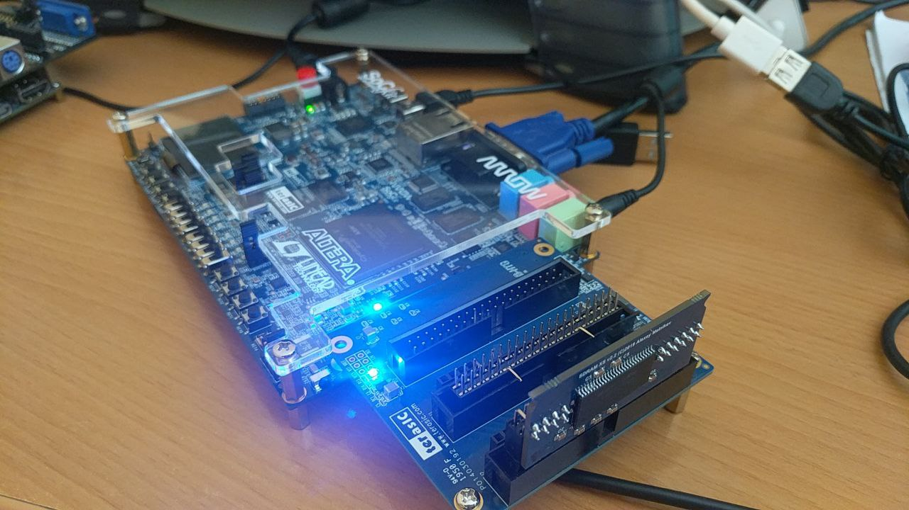
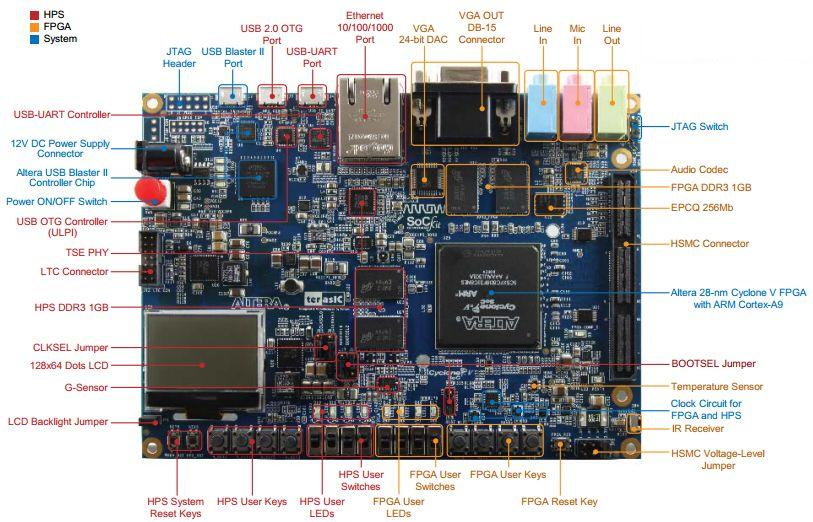
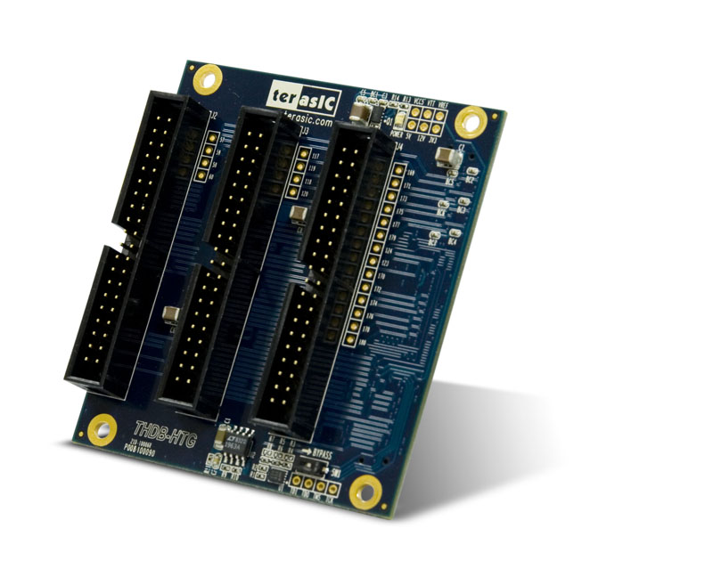
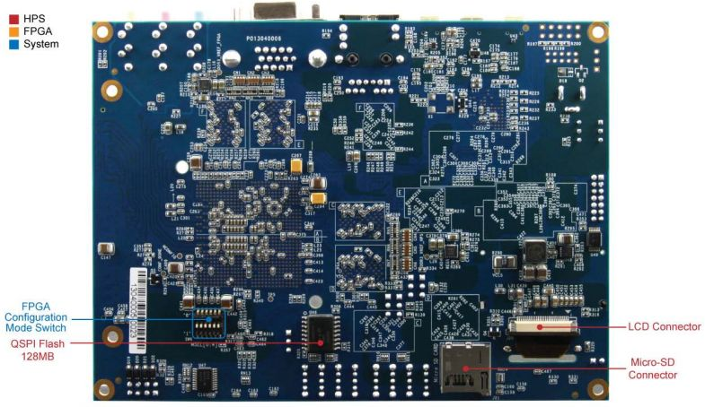
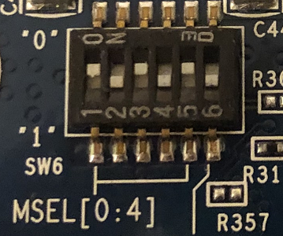
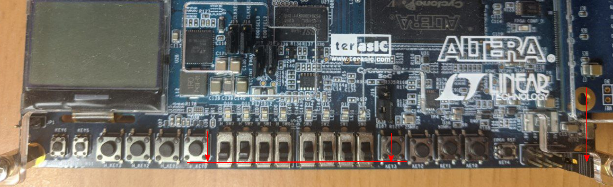
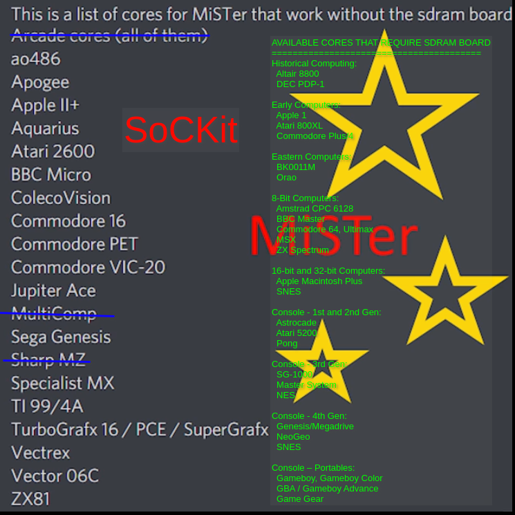
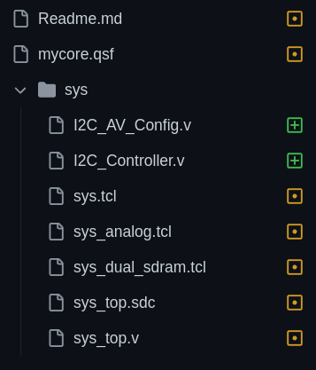

# SoCkit FPGA MiSTer compatible platform

Find below information about converting your SoCkit FPGA board into a MiSTer compatible platform with the latest firmware and framework.

* Setup SoCkit MiSTer: Set dip switches; Set slide switches; Prepare / update Micro SD card for MiSTer SoCkit; SD folder structure; Download SoCkit MiSTer compatible cores to the SD card

* SoCkit Switches / Buttons / Leds

* SoCkit HSMC GPIO addon assignments
* Using MiSTer SDRAM modules.   List of cores working with and without SDRAM expansion
* Porting MiSTer Cores to SoCkit

Some of the information below is taken from [ModernHackers](https://github.com/MiSTer-Arrow-SoCKit/Main_MiSTer/wiki ) so we acknowledge and thank them for his awesome previous 2019 work on porting the MiSTer framework and cores to SoCkit. 

The SoCKit Development Kit presents a robust hardware design platform built around the Altera Cyclone V System-on-Chip (SoC) FPGA, which integrates an ARM-based hard processor system (HPS) consisting of processor, peripherals and memory interfaces tied seamlessly with a 110K Logic Elements. The SoCKit development board includes hardware such as high-speed DDR3 memory, video and audio capabilities, Ethernet networking, and much more.

SoCkit board has many similarities with the DE10-nano board and therefore it is compatible with the MiSTer platform. The same applies to the DE10-Standard and DE1-SoC boards all from Terasic.

The SoCkit port leverages all built-in hardware capabilities of the board:

* VGA 24 bit analog video output
* Audio CODEC with line-in, line-out, and mic input

Main difference with the DE10-nano is that it does not include an HDMI video output and that it is required to buy an additional HSMC-GPIO adapter to attach SDRAM [compatible MiSTer modules](http://modernhackers.com/128mb-sdram-board-on-de10-standard-de1-soc-and-arrow-sockit-fpga-sdram-riser/). If you do not have HMSC-GPIO addon board, you can only run those cores that do not require SDRAM, for example Genesis.

Arrow SoCKit port of MiSTer scales original video resolution to a standard VGA resolution (usually 1280x720p60), so you don't need to look for some ancient low Hz monitor (you will have to enable scaler mode in MiSTer.ini).

All ported and tested cores for Arrow SoCKit are listed at [SoCkitfpga repositories](https://github.com/orgs/sockitfpga/repositories) tagged with `mister` topic






HSMC-GPIO male addon board (P0033 reference from [Terasic](https://www.terasic.com.tw/cgi-bin/page/archive.pl?Language=English&CategoryNo=67&No=322&PartNo=2#heading))

## Setup SoCkit MiSTer

### **1. Set the dip switches on the board to the following position**

You can find the dip switches on the bottom-left corner:



Zoomed dip switch status:



If you miss this step your board is not able to boot-up from the SD card and not able to load the menu.rbf file and your video output will be blank.

### **2. Set the slide switches to down position**

You need to set to down position all slide switches:



Also notice that for the GPIO addon SDRAM expansion the jumper needs to be in the 3V3 last position.

### **3. Prepare / update Micro SD card for MiSTer SoCkit**

#### Linux script to build a MiSTer SD card for Arrow SoCkit FPGA (20221224)

Adapted from https://github.com/michaelshmitty/SD-Installer-macos_MiSTer

* Execute the script [MiSTer-sd-installer-linux.sh](MiSTer-sd-installer-linux.sh) to build the MiSTer SD card (updated to main/menu/linux 20221224)
  * dependencies: 7z `sudo apt install p7zip`

* Copy this recommended [MiSTer.ini](MiSTer.ini) to the root folder of SD card. If you copy the original MiSTer.ini make sure to modify at least the following parameters:
  * vga_scaler=1   is needed to see picture on a standard VGA monitor 
  * forced_scandoubler=1 is needed for most modern monitors (31 kHz)


Just for historical reference [here](old_firmware/) is how I ported the old 2019 firmware/framework from ModernHackers.

#### Windows SD-installer 

*  Download [MiSTer SoCkit](https://github.com/goofyseeker311/MiSTer_SoCkit/tree/main/releases) latest release and follow the how-to instructions

*  Follow instructions below to update your SD card

#### Updating your current MiSTer SD card

Replace existing archives/folders in your existing SD card with this ones:

*  [MiSTer](MiSTer) (20221224) or get the latest release one from [MiSTer-devel](https://github.com/MiSTer-devel/Main_MiSTer/tree/master/releases)
*  [menu.rbf](menu.rbf) (20221224) (menu is specific for SoCkit so you cannot use the ones from MiSTer-devel)
*  [MiSTer.ini](MiSTer.ini) (20221224) or get the latest one from [MiSTer-devel](https://raw.githubusercontent.com/MiSTer-devel/Main_MiSTer/master/MiSTer.ini) but don't forget to modify at least the following parameters:
   * vga_scaler=1   is needed to see picture on a standard VGA monitor 
   * forced_scandoubler=1 is needed for most modern monitors (31 kHz)
*  [linux folder from files/linux](https://github.com/MiSTer-devel/SD-Installer-Win64_MiSTer/raw/master/release_20221224.7z) (20221224) or get the latest release from [MiSTer-devel](https://github.com/MiSTer-devel/SD-Installer-Win64_MiSTer)

### 4. SD folder structure 

Create the following folder structure in the SD card:

* _Arcade
  * place here the mra files
* _Arcade/cores
  * place here the Arcade rbf cores
* _Computer
  * place here the Computer rbf cores
* _Console
  * place here the Console rbf cores
* _Other
  * place here the Other rbf cores
* games
  * place here each core folder including the roms, vhds and any required files 

* games/mame
  * place here the Arcade rom files

Other folders are: cheats, docs, Filters, filters_audio, font, Presets, Shadow_Masks. You will find more info about those in the [MiSTer wiki](https://github.com/MiSTer-devel/Wiki_MiSTer/wiki).

### 5. Download SoCkit MiSTer compatible cores to the SD card

Find the latest rbf binaries of the cores in https://github.com/sockitfpga/SoCKit_binaries and copy them in the corresponding folder (_Arcade/cores, _Computer, _Console, _Other). For example try this template core [mycore.rbf](mycore_20221228.rbf)

For Arcades find the mra files in the releases folder of each arcade repository and for the Arcade roms you can use this script  [mame-merged-set-getter.sh](mame-merged-set-getter.sh) on your local machine or check this [link](https://pleasuredome.github.io/pleasuredome/).

If you don't find here the SoCkit port of a wished MiSTer core see the Porting Cores section below to easily port yourself.

All ported and tested cores for Arrow SoCKit are listed at [SoCkitfpga repositories](https://github.com/orgs/sockitfpga/repositories) tagged with `mister` topic

JOTEGO cores for SoCkit MiSTer platform can be found at [JTBIN](https://github.com/jotego/jtbin/tree/master/sockit)

More MiSTer compatible cores can be found at [Noemi's GitHub](https://github.com/noemi-abril) and [Patreon](https://www.patreon.com/noemiabril)

## SoCkit Switches / Buttons / Leds

**Switches:** 

* Default position is all switches pointing towards outside the board
  * 0 means switch position towards outside of the board
  * 1 means switch position towards inside of the board

- SW0: Audio pins output selection
  - 0 Audio Sigma-Delta and SPDIF pins output 
  - 1 I2S output though the  sigma delta and SPDIF audio pins 
- SW1: 
  - 0  MIDI I2S input enabled. All User IO pins enabled for input. 
  - 1  three User IO pins are disabled as inputs.
- SW2: Not used.
- SW3: Switch has no effect in SoCkit. Internally is wired to 0 in the cores as it is necessary for VGA output mode.
  - SW3=1 is used in DE10-nano for MiSTer dual SDRAM mode and disables functions of analog IO board (VGA, SD card, Sigma/Delta audio, SPDIF audio, Leds)

**Keys:**

- KEY 0 = OSD   button  (brings OSD to screen)
- KEY 1 = USER  button (usually is the own core's reset button)

- KEY 4 = RESET button (FPGA reset brings menu.rbf again to screen)

**Leds:**

-  LED 0 = USER led

- LED 1 = HDD led

- LED 2 = POWER led

- LED 3 = LOCKED led


## SoCkit HSMC GPIO addon assignments

* [HSMC_GPIO_pinout_assignments.md](HSMC_GPIO_pinout_assignments.md)


## Using MiSTer SDRAM modules

Read [ModernHackers blog](http://modernhackers.com/128mb-sdram-board-on-de10-standard-de1-soc-and-arrow-sockit-fpga-sdram-riser/)


#### List of cores working with and without SDRAM expansion

This list is based on the old framework ports by ModernHackers so they might not work with the latest MiSTer firmware.    If you don't find here the SoCkit port of a wished MiSTer core see the Porting Cores section below to easily port yourself.




## Porting MiSTer Cores to SoCkit

Check this [commit](https://github.com/sockitfpga/Template_SoCkit/commit/83e96dc0d1cc5bab2a711235ab325e1511e1ed2a) changes (new files (green) and modified files (orange)).    

A guide is available in Spanish (see below).

[Template core](https://github.com/sockitfpga/Template_SoCkit) contains all the latest changes needed for Sockit ports.





## Guia para portar cores de MiSTer a SoCkit

*  [Guía de portado de cores MiSTer a SoCkit](Portando_a_SoCkit.md)

La anterior guia sigue vigente pero no está basada en la última template. Para la última template consulta los cambios realizados en este [commit](https://github.com/sockitfpga/Template_SoCkit/commit/83e96dc0d1cc5bab2a711235ab325e1511e1ed2a) (nuevos ficheros en verde y modificados en naranja).    

####   Pasos en GitHub para portar un core

- Busco el core a portar en  https://github.com/orgs/MiSTer-devel/repositories 

- Forkeo el core de MiSTer desde la web del repositorio en mi GitHub personal

- Clono el fork en mi ordenador: `git clone ssh://url`   

- Borro los rbf de la carpeta releases (dejo el resto de ficheros como roms y mras)

- Porto el core según esta [guia](Portando_a_SoCkit.md)

  - Personalmente uso el programa Meld para comparar / copiar los ficheros indicados anteriormente en verde/naranja del core [Template](https://github.com/sockitfpga/Template_SoCkit) versus los del core a portar.  En Windows también se puede usar un programa llamado Beyond compare.

- Modifico el archivo README.md del core para indicar que se trata de un port de SoCkit y dar los créditos y enlace al repositorio del creador original

- Sintetizo el core con la versión  17.0.2 o 17.1([Linux](https://www.intel.com/content/www/us/en/software-kit/669440/intel-quartus-prime-lite-edition-design-software-version-17-1-for-linux.html?) o [Windows](https://www.intel.com/content/www/us/en/software-kit/669444/intel-quartus-prime-lite-edition-design-software-version-17-1-for-windows.html)) de Quartus Prime Lite edition y testeo el binario rbf generado

- Copio el fichero rbf en la carpeta releases/  con la fecha de creación (ejemplo: core_20220702.rbf)

- Cierro Quartus y limpio los ficheros inútiles que genera Quartus con el script clean.bat / [clean.sh](clean.sh)

- Subo a GitHub:

  ```sh
  #antes de subir a GitHub comprobar los archivos que han cambiado y las diferencias
  git status
  git diff
  #subir archivos
  git add .
  git commit -am "Sockit port"
  git push
  ```

  

### ModernHackers useful links regarding the old MiSTer port

* Main MiSTer port site https://github.com/MiSTer-Arrow-SoCKit/Main_MiSTer/wiki 
* Mister SDRAM expansion http://modernhackers.com/128mb-sdram-board-on-de10-standard-de1-soc-and-arrow-sockit-fpga-sdram-riser/

* Info about the port http://modernhackers.com/porting-mister-to-arrow-sockit-fpga/

* Comparison of ported cores between platforms http://modernhackers.com/mister/
